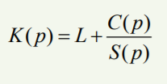

# Caching

#### By  [Shubham Borke](https://github.com/shubhamborke7778)

#### Aug 9, 2021

### Introduction

The cache is a process, that copies data in a temporary system location and can be access to load a website or system faster. It ensures that websites or Systems do not need to download data regularly. The process saves temporary data from software, servers, websites, etc.

Web caching is also known as the strategy of improving performance for web-based systems. The web caching mechanism is implemented in three ways: client level, proxy level, original server level. The cache is the core of web cashing, which takes places cache mechanisms, storing strategies, cache replacement, etc.

Cache storing mechanisms have limited space to use for the cache storing process. Here intelligence mechanism takes place to manage web content efficiency. What web-cache should store and what web-object should be replaced to make the best use of available cache space better, help to improve the performance of the system.

Nowadays, the cache concept is modified and simplest enough. Without storing additional data separately, systems save a copy of the page in a browser. In this way, web pages have read access faster.

### Web Cache

Web-cache is one of the best successful solutions for improving the performance of web-based systems. In the concept of caching, the repeated objects are kept in a position closer to the client machine or proxy servers. Those, web caching reduces extra timeout taken by websites.

There are three types of fundamentals in web-caching to store cache.
1. Browser cache
2. Proxy server cache
3. Original server cache

#### 1. Browser Cache

Browser cache is located near the client system. The client can observe it in internet browsers. The cache is useful when the client revisits the page. To store cache for each page are separated with a key of that page key name.

#### 2. Proxy Server Cache

Proxy server cache is found in proxy servers where clients accessing data from. It helps to serve data faster from web and client also. When the rapid request arrives at the proxy server will check further for the cache. If a cache key is found then similar contents will serve to the client or similar checks for web to receive it.

#### 3. Original Server Cache

Original server cache is saved on server-site to reduce redundancy of repeat requests from proxy servers. Server load will be reduced if cache stored exists in server-site.

### Algoritham

Cache has an algorithm to store in or store out. As the cache has a limited size to store. If cache memory is full with a storing object, there will be amount of data loss happen if no space reserve for the cache. Hence the cache algorithm takes place. The cache should evict the data to allow space for the new object.

In the industry, there is a lot of algorithms for storing cache.
The most commonly used algorithm is Least-Recently-Used(LRL). It removes least used objects until requires space for writing cache data. The least-recently-used method is easy to implement and simply accessible for uniform-size objects or data. Hence the cache is populated with small objects size for availability to store the extra amount of data.

When cache space is occupied and removed the least frequent data for store a new object, the algorithm is used here as a formula describe down.

### Limitations and Solutions

* When there is no key to store empty data to write data in the cache, all requests hit the database. With the slight modification of code, it is possible to create keys for requests. Often requests results return null.

* Another solution with "Bloom filter" is possible. Which creates barriers before the cache to store all keys exits in the current database. If the request key is not present then it will avoid chacking cache data and return null directly. If a key is present in the database, the matched key will go through the database. 

* We can use a lock mechanism for the cache. When the first request is initiated, the data in the cache will be locked. At this time other queries will not able to access data until a request to complete. After lock release, the waiting queries will be directly retrieved data from the cache.

### Resources

* [Introduction of caching](https://en.wikipedia.org/wiki/Cache_(computing)) 

* [What is chaching](https://www.fortinet.com/resources/cyberglossary/what-is-caching)

* [Improvement in internet performance](https://www.3pillarglobal.com/insights/blog-posts/how-web-caching-improves-internet-performance/)

* [Problems and solution on caching](https://medium.com/@mena.meseha/3-major-problems-and-solutions-in-the-cache-world-155ecae41d4f)

* [Algoritham study](https://www.researchgate.net/publication/265986051_A_Survey_of_Web_Caching_and_Prefetching_A_Survey_of_Web_Caching_and_Prefetching)